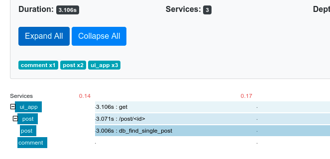
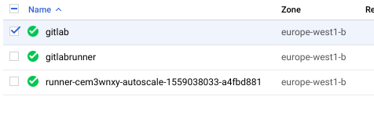

[](https://travis-ci.com/otus-devops-2019-02/skushnerchuk_microservices)

### Homework 20 (kubernetes-1)
## Основное задание


Выполнена установка и настройка кластера в соответвии с **kubernetes-the-hard-way**


<details>
<summary>Homework 19 (logging-1)</summary>
## Основное задание

Установлен и настроен стек EFK для сбора и централизованного хранения логов. Выполнено подключение fluentd к компонентам приложения.

## Задание со *

Написан фильтр для парсинга неструктурированных логов

Решена проблема тормозов приложения при открытии поста.

Zipkin показал trace до проблемной функции:



В данной функции была искусственная пауза в 3 секунды. После ее исключения все работает нормально.

Также пришлось чинить сборку поломанного приложения.
</details>

<details>
<summary>Homework 18 (monitoring-2)</summary>
## Основное задание
Проведены исследования по мониторингу и сборке метрик с тестового приложения и хостовой машины, в том числе docker.

Выполнена подготовка и настройка dashboards в Graphana для отображения необходимых метрик.

Настроены уведомления об остановке каких-либо компонент системы, также добавлена отправка таких уведомлений в slack-чат (https://devops-team-otus.slack.com/messages/CH2FTQXQE/)

## Задание со *
Доработан Makefile для работы с новыми образами

Добавлена сборка метрик с Docker:
- создан файл ```/etc/docker/daemon.json```
- в нем указаны параметры для отправки метрик:
```json
{
  "metrics-addr" : "0.0.0.0:9323",
  "experimental" : true
}
```
В конфигурации Prometheus добавлена цель:
```yaml
- job_name: "docker"
  static_configs:
    - targets:
      - "127.0.0.1:9323"
```
</details>

<details>
<summary>Homework 17 (monitoring-1)</summary>
## Основное задание

Проведены эксмерименты по запуску и исследованию работы Prometheus.
Выполнены работы по контейнеризации мониторинга совместо с приложением и зависимостями.

**Задание со \***

- Для мониторинга mongodb использоваля percona/mongodb_exporter1
- Добавлен мониторинг с помощью Cloudprober
- Создан Makefile который умеет собирать и пушить образы на [DockerHub](https://hub.docker.com/u/drcoyote):

`make` собрать и залить в репозитарий все образы, указанные в переменных Makefile (SOURCES, IMAGES)

`make build_all` - собрать все образы, перечисленные в переменной SOURCES

`make push_all` - залить в репозитарий все образы, перечисленные в переменной IMAGES

`make SRC=ui build` - собрать образ из папки ui

`make IMAGE=ui push` - залить в репозитарий образ $USER_NAME/ui

`make IMAGE=ui SRC=ui build push` - собрать образ из папки ui залить в репозитарий образ $USER_NAME/ui
</details>


<details>
<summary>Homework 16 (gitlab-ci-1)</summary>

#### Сделано:
Проведены эксперименты с GitLab:
- установка и настройка
- работа с репозитариями
- работа с pipeline
- работа с runners

Установка экземпляра GitLab:

В папке gitlab-ci/gitlab_instance выполнить команду:
```
terraform plan
```

**Задания со \***

**Сборка и деплой контейнера приложения**

Для развертывания приложения после сборки контейнера в настройках проекта были добавлены перменные:
```
CI_REGISTRY_PASSWORD
CI_REGISTRY_USER
SSH_PRIVATE_KEY
```
Вирутальная машина для развертывания приложения поднималась вручную.

После коммита и отработки pipeline на целевой машине поднимался контейнер с приложением.

**Автоматизация развертывания и регистрации runners**

Для достижения цели использовался [GitLab bastion](https://about.gitlab.com/2018/06/19/autoscale-continuous-deployment-gitlab-runner-digital-ocean/)

Последовательность создания:

Установить локально роли:
```
ansible-galaxy install geerlingguy.docker
ansible-galaxy install riemers.gitlab-runner
ansible-galaxy install wtanaka.gcloud_sdk
```

Основную задачу по настройке и регистрации runner выполняла роль **riemers.gitlab-runner**, что позволило свести ручную работу к минимуму.

В папке gitlab-ci/gitlab_instance в файле **gitlabrunner_vars.yml** установить переменные:
```
gitlab_runner_coordinator_url
gitlab_runner_registration_token
google-project
```
После чего выполнить в этой же папке команду
```
terraform init
```
Зайти на созданный инстанс и выполнить там команды:
```
gcloud init --console-only
gcloud auth application-default login
```

После этого runner будет зарегистрирован в GitLab  и готов к работе. После коммита автоматически будет создан еще один runner:



**Выполнена интеграция GitLab и Slack** с помощью веб-хуков: [канал](https://devops-team-otus.slack.com/messages/CH2FTQXQE)
</details>

<details>
<summary>Homework 15 (docker-4)</summary>

После выполнения команды
```
docker run --network host -d nginx
```
ее повтор приведет к провалу запуска, так как первый контейнер уже занял нужные адрес/порт:
```
nginx: [emerg] bind() to 0.0.0.0:80 failed (98: Address already in use)
```

**docker-compose**

Базовое имя проекта можно задать с помощью ключа -p при старте:
```bash
docker-compose -p my_project up -d
```
По умолчанию в качестве имени проекта используется имя директории, откуда осуществляется запуск.

**Задание со \***

Для того чтобы иметь возможность изменения кода, не меняя образ, мы можем смонтировать папки с исходниками с помощью конструкции:
```Dockerfile
volumes:
  - type: bind
    source: ./post-py
    target: /app
```
Эта возможность, а также ручной запуск **puma** вынесены в файл **docker-compose.override.yml**
</details>
<details>
<summary>Homework 14 (docker-3)</summary>
**Основное задание**

Создана новая структура приложения для формирования микросервисной архитектуры

**Задание со \***

Для изменения значения переменных используем ключ "-e":
```bash
$ docker run -d --network=reddit --network-alias=post_db_alt --network-alias=comment_db_alt mongo:latest
$ docker run -d --network=reddit --network-alias=post_alt -e POST_DATABASE_HOST=post_db_alt skushnerchuk/post:1.0
$ docker run -d --network=reddit --network-alias=comment_alt -e COMMENT_DATABASE_HOST=comment_db_alt skushnerchuk/comment:1.0
$ docker run -d --network=reddit -p 9292:9292 -e POST_SERVICE_HOST=post_alt -e COMMENT_SERVICE_HOST=comment_alt skushnerchuk/ui:1.0
```

Подключено внешнее хранилище к контейнеру с mongo:
```
docker run -d --network=reddit --network-alias=post_db --network-alias=comment_db -v reddit_db:/data/db mongo:latest
```
Все образы пересобраны на основе alpine:
```bash
REPOSITORY                TAG                 SIZE
drcoyote/post             1.0                 67.1MB
drcoyote/comment          1.0                 63.4MB
drcoyote/ui               1.0                 66.2MB
```
</details>

<details>
<summary>Homework 13 (docker-2)</summary>
**Основное задание**

Выполнено создание нового проекта в GCP

Повторил практику из лекции:
$ docker run -d --network=reddit --network-alias=post_db_alt --network-alias=comment_db_alt mongo:latest
$ docker run -d --network=reddit --network-alias=post_alt -e POST_DATABASE_HOST=post_db_alt skushnerchuk/post:1.0
$ docker run -d --network=reddit --network-alias=comment_alt -e COMMENT_DATABASE_HOST=comment_db_alt skushnerchuk/
comment:1.0
$ docker run -d --network=reddit -p 9292:9292 -e POST_SERVICE_HOST=post_alt -e COMMENT_SERVICE_HOST=comment_alt
skushnerchuk/ui:1.0
```

Подключено внешнее хранилище к контейнеру с mongo:
```
docker run -d --network=reddit --network-alias=post_db --network-alias=comment_db -v reddit_db:/data/db mongo:latest
```

Все образы пересобраны на основе alpine:
```
REPOSITORY                TAG                 SIZE
drcoyote/post             1.0                 67.1MB
drcoyote/comment          1.0                 63.4MB
drcoyote/ui               1.0                 66.2MB
```

<details>
<summary>Homework 13 (docker-2)</summary>
### Homework 13 (docker-2)
**Основное задание**

Выполнено создание нового проекта в GCP

Повторил практику из лекции:
- PID namespace (изоляция процессов)
- net namespace (изоляция сети)
- user namespaces (изоляция пользователей)

Результаты сравнения
```docker
docker run --rm -ti tehbilly/htop
docker run --rm --pid host -ti tehbilly/htop
```
В первом случае htop отображает только только PID 1 контейнера, во втором - множество процессов хостовой системы.

Создан Dockerfile с приложением, на его основе построен образ и залит на Docker Hub

**Задания со \***

Написан шаблон пакера, создающий оброаз с уже установленным docker

С использованием этого шаблона создана конфигурация terraform, которая используется для поднятия приложения с указанным количеством экземпляров ВМ.

Написаны ansible playbooks для установки докера в образ и для запуска контейнера после поднятия инфраструктуры.
</details>

<details>
<summary>Homework 12 (docker-1)</summary>

**Основное задание**

- Установлены docker, docker-compose, docker-machine;
- Рассмотрели жизненные циклы контейнера на примере стандартных образов (hello-world, ubuntu, nginx);

**Задания со \***
- Рассмотрены различия между образом и конейнером.
</details>
